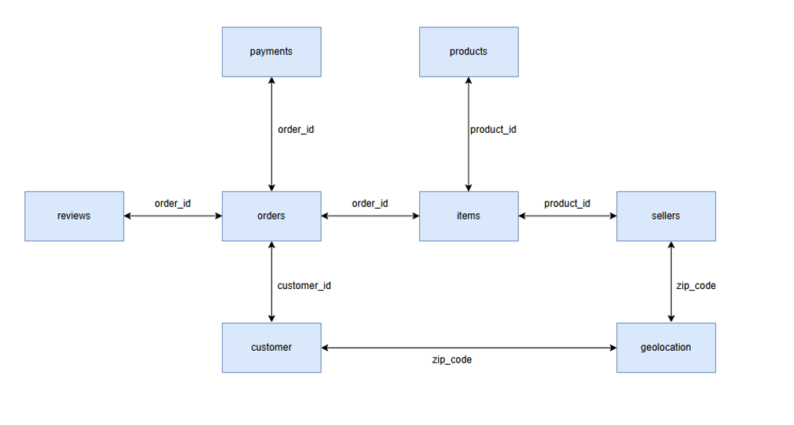

# Data Engineering and Analytics Project with Brazilian E-Commerce Data

This project uses the Brazilian E-Commerce Public Dataset by Olist from Kaggle.
The goal of the project is to practice both Data Engineering and Data Analytics skills by building a complete end-to-end workflow using Python, PostgreSQL, SQL, and Power BI.

## Dataset Source
Brazilian E-Commerce Public Dataset by Olist: https://www.kaggle.com/datasets/olistbr/brazilian-ecommerce

## Project Plan

### 1. Data Extraction & Cleaning
- Import CSV files with Python and Pandas
- Load cleaned data into PostgreSQL

### 2. PostgreSQL Database
- Create staging and analytics tables
- Design warehouse-style tables for analysis

### 3. SQL Analytics
- Create analytical queries
- Build KPIs and business reports
- Practice joins, aggregations, indexes, and views

### 4. Visualization
- Connect PostgreSQL to Power BI
- Create dashboards and reports
- Build additional visualizations in Python

## Tech Stack
- Python
- PostgreSQL
- SQL
- Power BI
- Git, GitHub

## Table Relation

